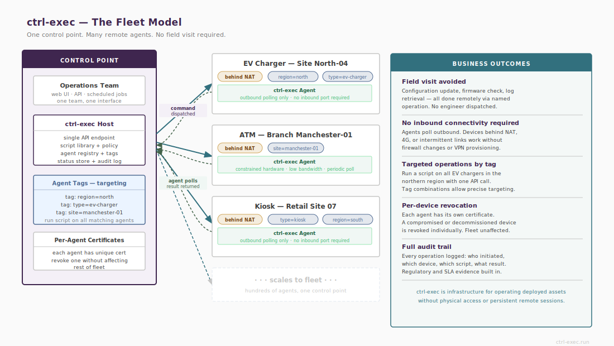

# What an Agent Is



`ctrl-exec-agent` (`cea`) is a lightweight daemon that runs on each managed host. It listens on port 7443 over mTLS, enforces a local script allowlist, and executes scripts on request from an authorised ctrl-exec instance.

An agent holds no state that cannot be reconstructed from its configuration files. It does not contact ctrl-exec except when responding to incoming requests — there is no polling, no keepalive, and no persistent connection.

# Agent Registration

An agent joins the fleet through the pairing protocol. Pairing is a one-time ceremony that establishes mutual trust:

- The agent receives a CA-signed certificate identifying it to ctrl-exec.
- The agent stores the ctrl-exec's certificate serial number, which it verifies on every subsequent connection.
- ctrl-exec records the agent in the registry at `/var/lib/ctrl-exec/agents/`.

After pairing, the agent is identified by its certificate serial. The registry entry contains the hostname, IP, pairing timestamp, certificate expiry, and serial confirmation state.

See [Pairing](/pairing) for the full protocol.

# The Allowlist

The allowlist is defined in `/etc/ctrl-exec-agent/scripts.conf`. It maps short names to absolute script paths:

```ini
backup-mysql  = /opt/ctrl-exec-scripts/backup-mysql.sh
check-disk    = /opt/ctrl-exec-scripts/check-disk.sh
restart-app   = /opt/ctrl-exec-scripts/restart-app.sh
```

Only names present in this file can be requested from this agent. The allowlist is the agent's primary security boundary — not a filter on top of broad access, but the complete definition of what is possible.

Script name rules:

- Must match `[\w-]+` — alphanumeric, underscore, and hyphen only.
- No slashes, dots, or shell metacharacters.
- Names are case-sensitive.

The `script_dirs` configuration key adds a second layer: if set, only scripts under the approved directories are permitted regardless of what the allowlist says. This guards against allowlist entries pointing to unintended locations.

The allowlist and `agent.conf` reload on SIGHUP without restarting:

```bash
sudo systemctl kill --signal=HUP ctrl-exec-agent
# or on OpenWrt:
/etc/init.d/ctrl-exec-agent reload
```

# Capabilities Response

When ctrl-exec calls `/discovery` on an agent, the agent returns its current capabilities: the list of allowlisted scripts (name, path, and whether the path is executable) and its tags.

This is used by `ctrl-exec-api`'s `/openapi-live.json` endpoint to generate a live OpenAPI spec reflecting the actual scripts installed on each connected agent. It is also used by `ced list-agents` to show what each agent can do.

A script that exists in the allowlist but whose path is not executable or not present is reported with `"executable": false`. Such scripts will fail at execution time.

# Agent Tags

Tags are arbitrary key/value pairs set in the `[tags]` section of `agent.conf`. They are returned in discovery and capabilities responses and can be used by external tooling to target logical groups of agents.

```ini
[tags]
env  = production
role = database
site = london
```

Tags are reloaded on SIGHUP. ctrl-exec does not interpret tag values — they are metadata for callers and integrations.

# Agent Modes

## serve

Normal operation. Listens for incoming mTLS connections from ctrl-exec and serves requests.

```bash
ctrl-exec-agent serve
ctrl-exec-agent serve --config /etc/ctrl-exec-agent/agent.conf
```

## self-ping

Connects to `127.0.0.1:7443` using the agent's own certificate. Confirms the port is listening and mTLS is functional. The expected response is `403 serial mismatch` — the agent's own certificate is not a ctrl-exec certificate, and the agent correctly rejects it. Any other result indicates a configuration problem.

```bash
ctrl-exec-agent self-ping
```

## self-check

Validates the agent configuration without making any network connections. Checks certificate files, configuration keys, and allowlist entries. Useful for validating a new configuration before reloading.

```bash
ctrl-exec-agent self-check
```

## pairing-status

Shows the agent's current certificate, expiry date, and the stored ctrl-exec serial number.

```bash
ctrl-exec-agent pairing-status
```

# Certificate Renewal

Agent certificates are renewed automatically. Renewal is triggered after every successful ping when the agent's remaining certificate validity falls below half the configured `cert_days` (default: 365 days, threshold at approximately 182 days remaining).

No operator action is needed during normal operation. Renewal failure is logged at ERR and retried on the next ping. A certificate that fails repeatedly will eventually expire and require re-pairing.

# Cert Serial Tracking

The agent stores the ctrl-exec's certificate serial in `/etc/ctrl-exec-agent/dispatcher-serial`. Every incoming connection is checked against this value. A mismatch is rejected with 403 and logged as `ACTION=serial-reject`.

After a ctrl-exec certificate rotation (`ced rotate-cert`), all agents must receive the new serial. Agents that were offline during the broadcast will reject ctrl-exec until the update is delivered. The overlap window (`cert_overlap_days`) is the time allowed for this.

An agent reporting `serial-reject` consistently after a rotation should be checked with:

```bash
ctrl-exec serial-status
```
