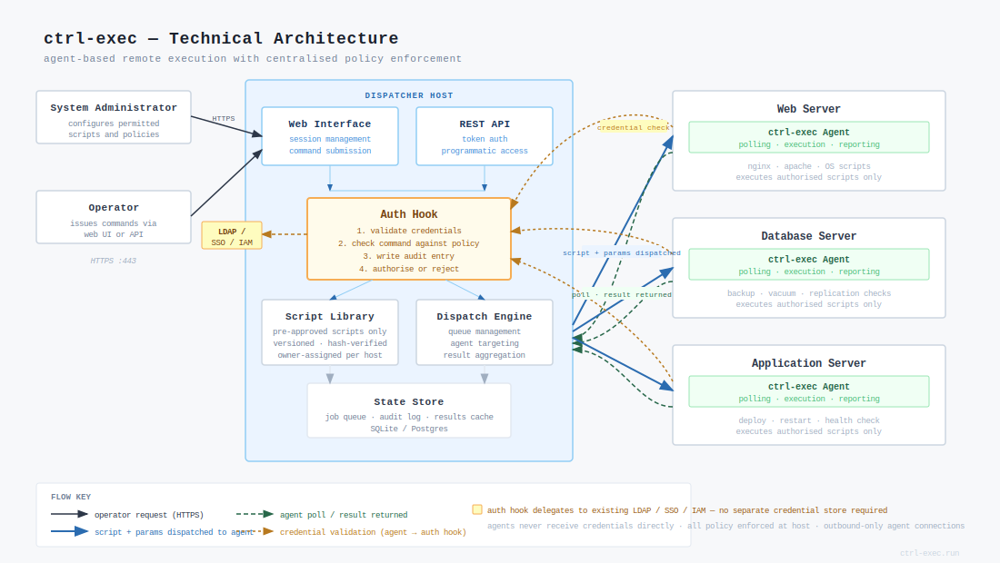
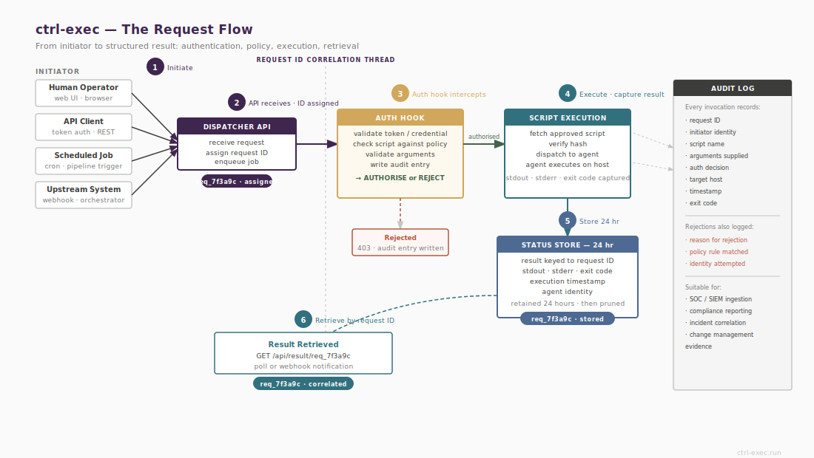

# Components



`ctrl-exec-dispatcher` (`ced`)
: The control host binary. Manages the CA, handles agent pairing, dispatches commands to agents, and maintains the agent registry. The CLI is stateless — each invocation opens connections, collects results, and exits. There is no ctrl-exec daemon to manage.

`ctrl-exec-agent` (`cea`)
: The daemon running on each remote host. Listens on port 7443 over mTLS. Enforces the local script allowlist. Executes scripts on request, captures output, and returns results. Holds no state that cannot be reconstructed from its configuration files.

`ctrl-exec-api`
: An optional HTTP API server running on the control host. Exposes the same `run`, `ping`, and `discovery` operations as the CLI as JSON endpoints. Shares the CA and configuration with `ced`. Useful for integration with external tools, automation pipelines, and custom dashboards.

::: widebox
All persistent state is files on disk. The dispatcher process holds no runtime state. Any number of ctrl-exec instances sharing the same state files can serve requests interchangeably.
:::

# Execution Flow



A `ced run host-a backup-mysql` invocation proceeds as follows:

1. `ced` reads its config and the agent registry to resolve `host-a` to an IP and port.
2. If a ctrl-exec-side auth hook is configured, it is called with the full request context — script name, hosts, arguments, username, token, source IP. A non-zero exit aborts the request before any connection is made.
3. `ced` checks the concurrency lock for `host-a:backup-mysql`. If the script is already running on that host, the request is rejected with a lock conflict.
4. `ced` opens an mTLS connection to `host-a:7443`. Both sides verify the peer certificate against the CA. The agent additionally checks the ctrl-exec cert serial against the value stored at pairing time.
5. `ced` sends a JSON request body containing the script name, arguments, request ID (`REQID`), username, and token.
6. The agent validates the script name against its allowlist. If the name is not present, the agent logs `ACTION=deny` and returns 403.
7. If an agent-side auth hook is configured, it runs after allowlist validation.
8. The agent forks and executes the script. The full request context is piped as JSON to the script's stdin. Arguments are passed on the command line.
9. The agent captures stdout, stderr, and exit code. On completion it logs `ACTION=run EXIT=<n>` and returns the result.
10. `ced` logs `ACTION=run EXIT=<n>` with the same `REQID`, releases the concurrency lock, and prints results.

For multi-host dispatch (`ced run host-a host-b backup-mysql`), steps 4–10 run in parallel for each host.

# The Agent Allowlist

The allowlist is defined in `/etc/ctrl-exec-agent/scripts.conf` on each agent. It maps a short name to an absolute script path:

```ini
backup-mysql  = /opt/ctrl-exec-scripts/backup-mysql.sh
check-disk    = /opt/ctrl-exec-scripts/check-disk.sh
```

Only names present in this file can be requested. Script names must match `[\w-]+` — no slashes, no dots, no shell metacharacters. The agent also enforces `script_dirs`: if set, only scripts under approved directories are permitted regardless of what the allowlist says.

The allowlist is the primary security control. It is defined on the agent, not the caller. A script that is not on the allowlist is structurally unreachable — not filtered, not logged as denied, simply not present in the set of possible operations.

The allowlist reloads on SIGHUP without a restart:

```bash
sudo systemctl kill --signal=HUP ctrl-exec-agent
```

# Persistent State

State is divided into configuration and CA material (which must be backed up), runtime registry state (which must be replicated in HA deployments), and transient files (which are local to each instance and can be discarded).

`/etc/ctrl-exec/`
: CA key and certificate, ctrl-exec TLS key and certificate, auth hook. The CA key is the root of trust for the deployment — back it up to encrypted offline storage. Access to the CA key allows issuing arbitrary agent certificates.

`/etc/ctrl-exec-agent/`
: Agent TLS key and certificate, CA certificate (for verifying ctrl-exec connections), `agent.conf`, `scripts.conf`, the stored ctrl-exec serial number, and an optional revocation list.

`/var/lib/ctrl-exec/agents/`
: Agent registry. One JSON file per paired agent, written atomically. Contains hostname, IP, pairing timestamp, cert expiry, and serial tracking state. Must be replicated in HA deployments.

`/var/lib/ctrl-exec/rotation.json`
: Cert rotation state: current serial, previous serial, overlap expiry. Must be replicated in HA deployments.

`/var/lib/ctrl-exec/locks/`
: Transient flock files for concurrency control. One per active `host:script` pair. Local to each instance. Not preserved across restarts and should not be on a shared filesystem.

`/var/lib/ctrl-exec/runs/`
: Run results stored by the API server. Keyed by `REQID`, retained for 24 hours. Required on a shared path only if `GET /status/{reqid}` must work regardless of which instance handled the original request.

`/var/lib/ctrl-exec/pairing/`
: Pending pairing requests. Short-lived; cleaned up within 10 minutes.

# Request IDs

Every operation generates a 16-character cryptographically random request ID (`REQID`). The same `REQID` appears in both the ctrl-exec and agent log entries for the same operation, enabling cross-host correlation:

```bash
grep 'REQID=a1b2c3d4' /var/log/syslog
```

For multi-host dispatches, the top-level `REQID` appears in the dispatch log entry; each per-host result carries the same ID.
