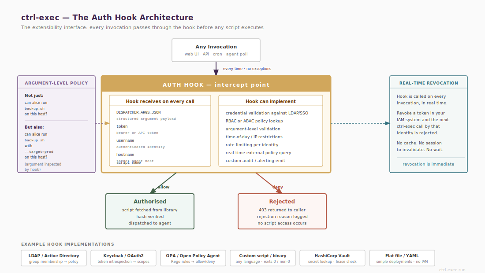

# Overview



ctrl-exec has no built-in ACL system. All access control beyond the allowlist is implemented in auth hooks — executable scripts or programs that receive request context and return an exit code.

There are two independent hook points:

ctrl-exec-side hook
: Configured in `ctrl-exec.conf` via `auth_hook`. Called before every `run`, `ping`, `capabilities`, and API request. Runs on the control host before any agent connection is made.

Agent-side hook
: Configured in `agent.conf` via `auth_hook`. Called on the agent after allowlist validation, before script execution. Covers `run` requests only.

Both hooks can be active simultaneously. They operate independently.

# Hook Invocation

The hook is called as a subprocess. It receives request context as environment variables and the same context as a JSON object on stdin. It must exit within the configured timeout (default: 10 seconds) or the request is denied.

stdout and stderr are discarded. Use syslog for audit logging from within the hook.

# Environment Variables

```
ENVEXEC_ACTION      run | ping | api
ENVEXEC_SCRIPT      script name requested (empty for ping)
ENVEXEC_HOSTS       comma-separated list of target hosts
ENVEXEC_ARGS        space-joined arguments — unreliable, see note below
ENVEXEC_ARGS_JSON   arguments as a JSON array string
ENVEXEC_USERNAME    username from the request (caller-supplied, not verified by ctrl-exec)
ENVEXEC_TOKEN       auth token from the request
ENVEXEC_SOURCE_IP   127.0.0.1 for CLI callers; caller IP for API callers
ENVEXEC_TIMESTAMP   ISO 8601 UTC timestamp
```

::: textbox
Always use `ENVEXEC_ARGS_JSON` for argument inspection. `ENVEXEC_ARGS` is space-joined and ambiguous for arguments containing spaces or newlines. It is retained for simple cases only.
:::

# Exit Codes

```
0   authorised — proceed
1   denied (generic)
2   denied — bad credentials
3   denied — insufficient privilege
```

Any non-zero exit aborts the request. The specific code is logged at `ACTION=auth` and returned to the caller. The API includes the code in the error response body.

# Token Forwarding

Tokens are forwarded from ctrl-exec through to agent hooks and to script stdin. A token validated at the ctrl-exec side is the same token available to the agent-side hook and to the script itself.

Tokens are never logged by ctrl-exec or the agent. To prevent tokens appearing in `ps` output, pass them via the environment rather than `--token`:

```bash
ENVEXEC_TOKEN=mytoken ced run host-a backup-mysql
```

# Writing a Hook

A hook can be any executable: shell script, Perl, Python, compiled binary. It must:

- Read `ENVEXEC_*` variables and/or stdin for request context.
- Exit with one of the codes above.
- Complete within the timeout.

## Example: per-token script restriction

```bash
#!/bin/bash
case "$ENVEXEC_TOKEN" in
    backup-token)
        [[ "$ENVEXEC_SCRIPT" == backup-* ]] || exit 3
        exit 0 ;;
    ops-token)
        exit 0 ;;
    *)
        exit 2 ;;
esac
```

## Example: argument inspection

Inspect a specific argument value using `ENVEXEC_ARGS_JSON` and `jq`:

```bash
#!/bin/bash
TARGET=$(echo "$ENVEXEC_ARGS_JSON" | jq -r '.[0] // empty')
case "$TARGET" in
    /var/log/*|/tmp/*) exit 0 ;;
    *) exit 3 ;;
esac
```

## Example: LDAP group membership check

```bash
#!/bin/bash
if [ -z "$ENVEXEC_USERNAME" ]; then
    exit 2
fi
ldapsearch -x -H ldap://ldap.example.com \
    -b "ou=groups,dc=example,dc=com" \
    "(&(objectClass=groupOfNames)(cn=ctrl-exec-ops)(member=uid=${ENVEXEC_USERNAME},ou=people,dc=example,dc=com))" \
    dn 2>/dev/null | grep -q '^dn:' || exit 3
exit 0
```

## Example: time-of-day restriction

```bash
#!/bin/bash
HOUR=$(date -u +%H)
# Allow only between 06:00 and 22:00 UTC
if [ "$HOUR" -lt 6 ] || [ "$HOUR" -ge 22 ]; then
    exit 3
fi
exit 0
```

# Hook Configuration

In `ctrl-exec.conf`:

```ini
auth_hook = /etc/ctrl-exec/hooks/auth.sh
```

In `agent.conf`:

```ini
auth_hook = /etc/ctrl-exec-agent/hooks/auth.sh
```

The hook must be executable by the user running ctrl-exec or the agent:

```bash
chmod 750 /etc/ctrl-exec/hooks/auth.sh
```

# API Auth Default

When the API server has no hook configured, the `api_auth_default` setting governs behaviour:

`deny` (default)
: All API requests are denied without a hook. This prevents accidental open access when deploying the API server for the first time.

`allow`
: All API requests are permitted. Only appropriate on a privately networked API server with no exposure to untrusted callers.

# Security Notes

- `ENVEXEC_USERNAME` is a caller-supplied string. ctrl-exec does not verify it. Validate usernames only via a token or an external authentication service.
- Do not log environment variables wholesale from within a hook — tokens will be written to your audit log. Log only the specific fields that are needed.
- The hook's working directory is not guaranteed. Use absolute paths for all file references.
- A hook that exits non-zero causes all requests to fail. Test hooks against the expected inputs before deploying to production.
