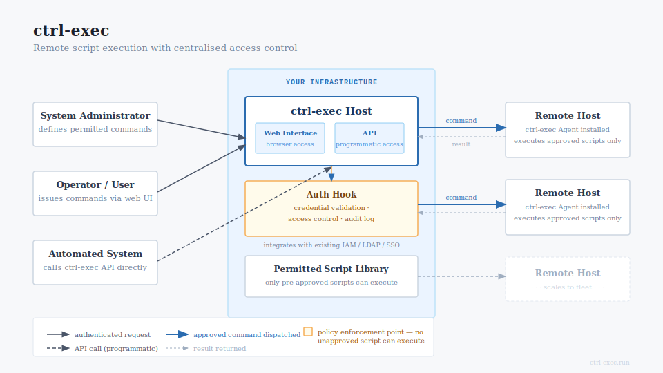

ctrl-exec is a remote script execution framework for Linux infrastructure. A lightweight agent runs on each managed host, listening on a private mTLS port. The control binary dispatches named scripts to one or more agents in parallel, with mutual certificate authentication, a structured audit log, and no shared credentials.

The dispatcher and each agent authenticate each other by certificate. There are no passwords, no SSH keys to distribute, and no ambient shell access. An agent executes only the scripts its operator has explicitly allowlisted. Everything else is structurally unreachable.

Start
: Install, configure, and run your first remote script. Covers prerequisites, CA initialisation, agent pairing, and the first dispatch.

Concepts
: How ctrl-exec works: the dispatcher and agent model, the mTLS trust chain, the allowlist, the pairing protocol, and the auth hook system.

Reference
: Complete CLI, API, configuration, and logging documentation. The authoritative source for every option, endpoint, and log field.

Operations
: Running ctrl-exec in production: high availability, the plugin ecosystem, certificate lifecycle, security operations guidance, and upgrade procedures.

Project
: Changelog, contribution guide, and how to run the test suite.

---

ctrl-exec is open source software released under the AGPL. The source is at [github.com/OpenDigitalCC/ctrl-exec](https://github.com/OpenDigitalCC/ctrl-exec). For commercial support and licensed distributions, see [ctrl-exec.com](https://ctrl-exec.com).
