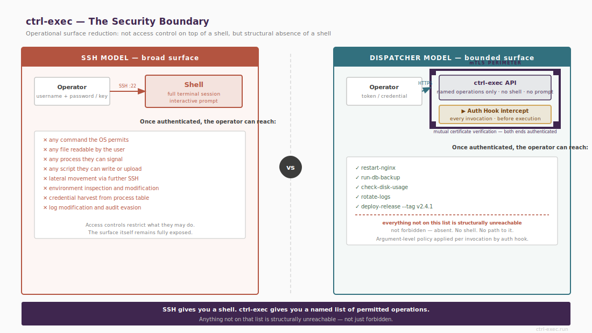

# mTLS Trust



ctrl-exec uses a private CA for all mTLS trust. The CA is created once on the ctrl-exec host and never leaves it. All agent certificates are signed by this CA. Neither ctrl-exec nor any agent trusts certificates from public CAs or any external source for the operational port.

When ctrl-exec connects to an agent:

- The agent verifies the ctrl-exec certificate was signed by the CA.
- ctrl-exec verifies the agent certificate was signed by the CA.
- The agent additionally checks the ctrl-exec certificate serial number against the value stored at pairing time.

The serial check means a certificate signed by the correct CA is not sufficient on its own — it must be the specific certificate the agent was paired with. A replacement certificate signed by the same CA is rejected until agents receive the new serial via `rotate-cert`.

There are no passwords, no shared secrets, and no SSH keys to distribute or rotate.

# The Pairing Protocol

Pairing is the ceremony by which a new agent joins the fleet. It runs on a separate port (7444 by default) using server-TLS only — the agent does not yet have a certificate to present.

1. The operator starts `ctrl-exec pairing-mode` on the ctrl-exec host. This opens a listener on port 7444.
2. On the agent host, the operator runs `ctrl-exec-agent request-pairing --dispatcher <hostname>`. The agent generates a key pair, creates a CSR, and connects to the pairing port.
3. Both sides independently compute a 6-digit verification code from the CSR content. The operator verifies that the codes match on both terminals before approving. This prevents CSR substitution or misrouting attacks.
4. On approval, ctrl-exec signs the CSR with the CA and returns the signed certificate along with the CA certificate and the current ctrl-exec certificate serial. The agent stores all three.
5. ctrl-exec records the agent in the registry with certificate expiry and serial tracking state.

Pairing is a deliberate one-time ceremony. The operator reviews each agent before it joins the fleet. The verification code step ensures that a rogue pairing request cannot be approved by mistake.

Automated pairing (`--background` flag) is available for orchestrated environments. The approval step remains explicit even in automated flows.

# Certificate Serial as Agent Identity

At pairing time, the agent stores the ctrl-exec's certificate serial number in `/etc/ctrl-exec-agent/dispatcher-serial`. On every subsequent `/run`, `/ping`, and `/capabilities` request, the agent compares the connecting certificate's serial against this stored value.

A mismatch is rejected with 403 and logged as `ACTION=serial-reject`.

This means that after any cert rotation, all agents must receive the new serial before the old certificate is retired. The `rotate-cert` command handles this: it generates a new certificate, broadcasts the new serial to all agents, and tracks per-agent confirmation in the registry. The overlap window (`cert_overlap_days`, default 30 days) is the time allowed for offline agents to reconnect and receive the update before they are marked stale.

An agent that has not yet received the new serial will reject ctrl-exec until it is updated. This is by design — it prevents a replacement cert from silently gaining access to agents that never consented to it.

# The Auth Hook System

The auth hook is the policy engine. ctrl-exec has no built-in ACL system — all access control beyond the allowlist is implemented in hooks.

There are two independent hook points:

ctrl-exec-side hook
: Configured in `ctrl-exec.conf` via `auth_hook`. Called before every `run`, `ping`, `capabilities`, and API request. Runs on the control host before any connection is made to an agent.

Agent-side hook
: Configured in `agent.conf` via `auth_hook`. Called on the agent after allowlist validation, before script execution. Applies to `run` requests only.

Both hooks can be configured simultaneously and operate independently.

## Hook Interface

The hook receives request context as environment variables:

```
ENVEXEC_ACTION      run | ping | api
ENVEXEC_SCRIPT      script name (empty for ping)
ENVEXEC_HOSTS       comma-separated target host list
ENVEXEC_ARGS        space-joined arguments — unreliable for args with spaces
ENVEXEC_ARGS_JSON   arguments as a JSON array string (use this for argument inspection)
ENVEXEC_USERNAME    username from the request (caller-supplied, not verified)
ENVEXEC_TOKEN       auth token from the request
ENVEXEC_SOURCE_IP   127.0.0.1 for CLI callers; caller IP for API callers
ENVEXEC_TIMESTAMP   ISO 8601 UTC timestamp
```

The same context is also available as a JSON object on stdin.

Always use `ENVEXEC_ARGS_JSON` for argument inspection. `ENVEXEC_ARGS` is space-joined and ambiguous for arguments containing spaces or newlines.

## Exit Codes

```
0   authorised — proceed
1   denied (generic)
2   denied — bad credentials
3   denied — insufficient privilege
```

Any non-zero exit aborts the request. The specific exit code is logged and returned to the caller.

## Token Forwarding

Tokens are forwarded from ctrl-exec through to agent hooks and to script stdin. This enables token validation at every stage of the execution pipeline — a token validated by the ctrl-exec-side hook is the same token available to the agent-side hook and to the script itself.

Tokens are never logged by ctrl-exec or the agent. Pass tokens via the `ENVEXEC_TOKEN` environment variable rather than `--token` to prevent the value appearing in `ps` output.

::: examplebox
Per-token script restriction — a simple hook that allows `backup-token` to run only backup scripts and `ops-token` to run anything:

```bash
#!/bin/bash
case "$ENVEXEC_TOKEN" in
    backup-token)
        [[ "$ENVEXEC_SCRIPT" == backup-* ]] || exit 3
        exit 0 ;;
    ops-token)
        exit 0 ;;
    *)
        exit 2 ;;
esac
```
:::

# The Allowlist as Security Boundary

The allowlist and the auth hook are complementary layers. The allowlist defines what can ever be called on an agent — it is a closed set of named operations, enforced on the agent, and not modifiable by callers. The auth hook defines who is permitted to call a given operation with what arguments.

::: widebox
An operation not on the allowlist is structurally unreachable. The auth hook governs the permitted set, not the possible set.
:::

A compromised credential grants access only to the operations that credential was authorised to invoke — not shell access, not filesystem access, not enumeration of other agents or operations.

# Certificate Revocation

The revocation list at `/etc/ctrl-exec-agent/revoked-serials` is checked on every incoming mTLS connection before any request is processed. To revoke a certificate, add its serial to this file on every agent and reload:

```bash
echo "serial=DEADBEEF" >> /etc/ctrl-exec-agent/revoked-serials
sudo systemctl kill --signal=HUP ctrl-exec-agent
```

For fleet-wide revocation, use `ced run` to push the serial append to all agents in parallel.

See [Security Operations](/security-ops) for certificate lifecycle management, CA compromise recovery, and monitoring guidance.
